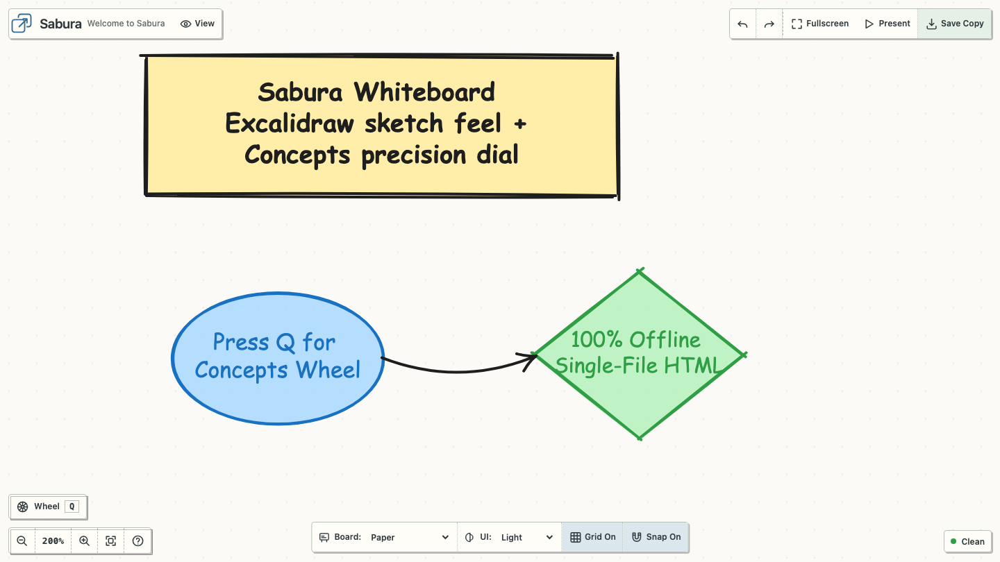

# Sabura

Sabura is a portable visual whiteboard that runs entirely from one HTML file.
Open it, draw and connect ideas, present the board, then use **Save Copy** to
create another self-contained document. No account, installation, server, or
network connection is required.



## Try it

Use the [hosted editor](https://kasfreedom.github.io/sabura-editor/), or download
[`sabura.html`](sabura.html) and open it in Google Chrome for fully offline use.

Choose **Edit**, or press `Q` to open the circular ToolWheel. Use **Save Copy**
when you want a new portable revision.

Every saved copy contains its document, images, revision lineage, and the editor
runtime. Your board stays local unless you choose to share the file.

## Example board

Explore the [Knowledge Graphs example](https://kasfreedom.github.io/sabura-editor/examples/knowledge-graphs.html)
to see a larger connected visual story made with Sabura. You can also
[download the self-contained HTML file](examples/knowledge-graphs.html) and open
it fully offline.

## Highlights

- One self-contained HTML document with no runtime dependencies or telemetry.
- Reading, editing, presentation, fullscreen, undo, and redo modes.
- Shapes, text, paths, connectors, groups, images, resize, and rotation.
- Paper, blueprint, night, and high-contrast themes.
- Deterministic document serialization and revision lineage.
- Optional, versioned live-agent API for structured browser automation.
- Runtime-size budget below 512 KiB, excluding embedded document content and assets.

## Browser support

Google Chrome is the primary release target and the browser used by the complete
release verification suite. Sabura may work in other modern desktop browsers,
but they are not currently part of the release gate.

## Agent authoring

Browser agents that can execute JavaScript in the loaded page can use the
versioned [`window.sabura.agent` API](docs/agent-api.md). It exposes copied
snapshots, atomic command batches, stale-edit detection, idempotent retries,
undo/redo, viewport focus, and Save Copy through the editor's normal validation
and history machinery. It does not introduce a server or network dependency.
Browsers with native WebMCP support additionally discover the same capabilities
as seven feature-detected tools; unsupported browsers continue unchanged.

The persistent document format is documented in
[`docs/canvas-v1-format.md`](docs/canvas-v1-format.md).

## Development

Requirements: Node.js 22 or later and npm.

```sh
npm ci
npm test
npm run build
```

The build produces `sabura.html` in the repository root and fails if the
payload-free runtime reaches the 512 KiB limit. Before a release, maintainers
also run the Chrome browser verification on macOS:

```sh
npm run test:e2e:chrome
```

See [`CONTRIBUTING.md`](CONTRIBUTING.md) for contribution expectations and
[`SECURITY.md`](SECURITY.md) for reporting security issues.

## License

Sabura is released under the [MIT License](LICENSE).
